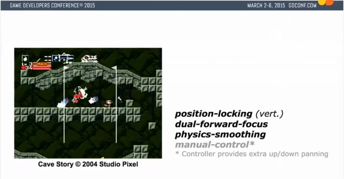
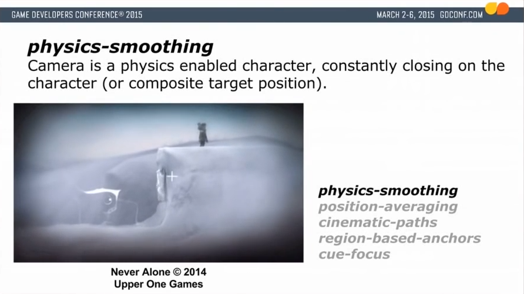

在移动或者调整窗口大小的情况下，SDL会停止工作，这样会造成一个很大的延迟时间，导致所有更新突然得到一个极大的deltaTime
这样的情况下会产生一些奇怪的毛病，比如运动体瞬间移动到很大一段距离
解决方法是使用一个最大延迟时间clamp稳定住延迟时间

## Timer

用于管理所有应用到倒计时的程序

为了同时更新所有倒计时，使用静态set保存所有Timer的指针，每次构造时将this塞入其中，析构时从中删除，Timer不可赋值/复制构造，这也是使用set的原因，视频中采用了boost库中的nocopyable

```c++
class Timer {
public:
	Timer(units::MS expirationTime, bool active = false):
		currentTime_(active? 0: expirationTime), expirationTime_(expirationTime) 
	{ timers_.insert(this); }
	~Timer() { timers_.erase(this); }

	void reset() { currentTime_ = 0; }
	bool isActive() { return currentTime_ < expirationTime_; }
	bool isExpired() { return !isActive(); }
	void update(units::MS deltaTime) { if(isActive()) currentTime_ += deltaTime; }
    
	static void updateAll(units::MS elapsed_time);
private:
	units::MS currentTime_;
	const units::MS expirationTime_;

	static std::set<Timer*> timers_;
};
```

## 场景/UI处理

把游戏模块区分为不同的scene，在主循环中调用scene的函数，像unity那样，scene使用树状结点结构，scene是根节点。

使用场景栈，需要的时候加入或者弹出场景

```c++
class Scene{
    public:
    Scene(Graphics& graphics, std::vector<GameObject&> gameObjects);
    void update(){
        for(auto& obj: gameObjects)
            obj.update();
    }
    void draw(){
        for(auto& obj: gameObjects)
            obj.draw();
    }
}
```

## 相机处理

参考: [How Cameras in Side-Scrollers Work](https://www.youtube.com/watch?v=pdvCO97jOQk) 非常详细地描述概括了绝大部分2d卷轴ACT游戏的镜头处理

(视频22.40)洞窟物语原作使用 双向集中, 根据角色朝向和速度移动镜头, 根据角色位置锁定, [平滑移动](https://www.reddit.com/r/gamedev/comments/4zbrgp/how_does_unitys_smoothdamp_work/)

详细：

- 相机追随框架位置
  - Quote(主角)面朝右侧的时候, 相机左边占6个Tile格子(不包括Quote)
  - 走路的时候, 相机缓慢追上Quote并保持相机左侧8格
- 相机移动速度根据Quote移动速度改变, 
  - 走路的过程中, 相机停下来需要两秒不到
  - 只是转向的话, 相机需要2.5秒停下来
- 平滑移动 [参考](https://graemepottsfolio.wordpress.com/2016/01/11/game-programming-math-libraries/)





## 碰撞处理

[参考](http://higherorderfun.com/blog/2012/05/20/the-guide-to-implementing-2d-platformers/) 主要讲了2D平台游戏的碰撞实现, 比如楼梯, 单向可穿过平台, 斜坡. 后面讲解了一些基本运动.

**加速实现**: 

1. 使用目标速度再用lerp进行逼近

   ```c
   vector2f curSpeed = a * targetSpeed + (1-a) * curSpeed;
   if (fabs(curSpeed.x) < threshold) curSpeed.x = 0;
   if (fabs(curSpeed.y) < threshold) curSpeed.y = 0;
   ```

2. 通常物理实现, 速度每时间加上加速度

   ```c
   vector2f direction = vector2f(sign(targetSpeed.x - curSpeed.x),
                                 sign(targetSpeed.y - curSpeed.y));
   curSpeed += acceleration * direction;
   if (sign(targetSpeed.x - curSpeed.x) != direction.x)
       curSpeed.x = targetSpeed.x;
   if (sign(targetSpeed.y - curSpeed.y) != direction.y)
       curSpeed.y = targetSpeed.y;
   ```

**跳跃实现**:

